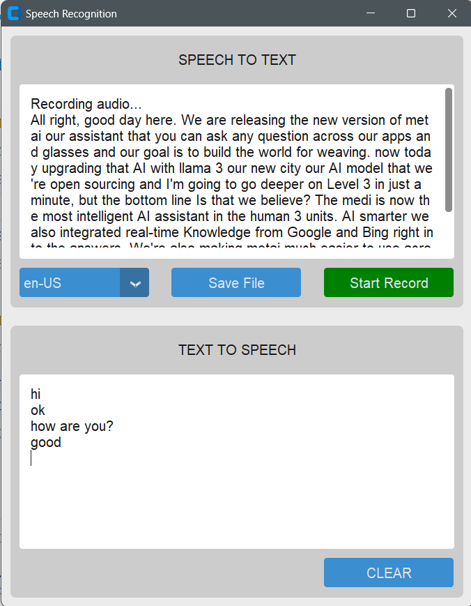
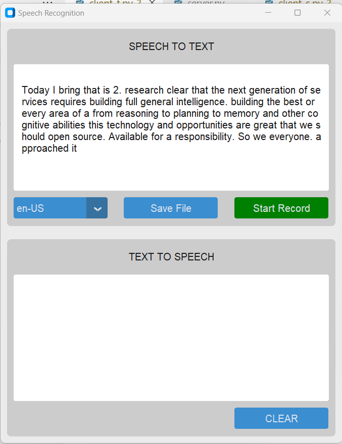
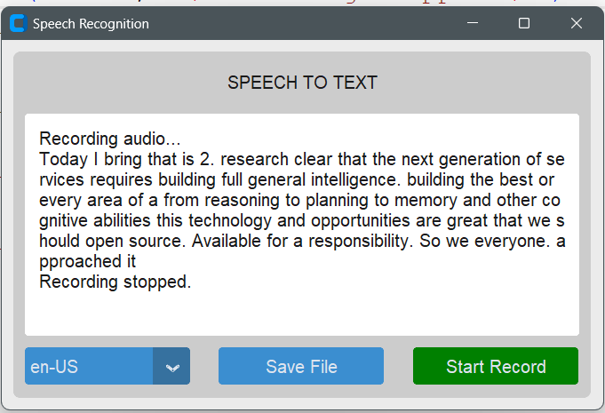

# Desktop application for speech-to-text and text-to-speech using Google Cloud Platform.

## Features
- Real-time speech-to-text
- Text-to-speech conversion
- Easy-to-use interface with CustomTkinter
  
Speech recognition and text-to-speech technologies have become increasingly vital in today's digital landscape. They enable hands-free control, real-time transcription, and seamless language communication. This project focuses on creating a desktop application that can perform real-time speech recognition and text-to-speech conversion. The application will benefit educational settings, providing live captions for lectures and individuals with hearing impairments and offering real-time transcription of spoken words.

## Demo
### student GUI

### classroom GUI
- student GUI - Received Transcription from Classroom GUI 

 
- classroom GUI  
